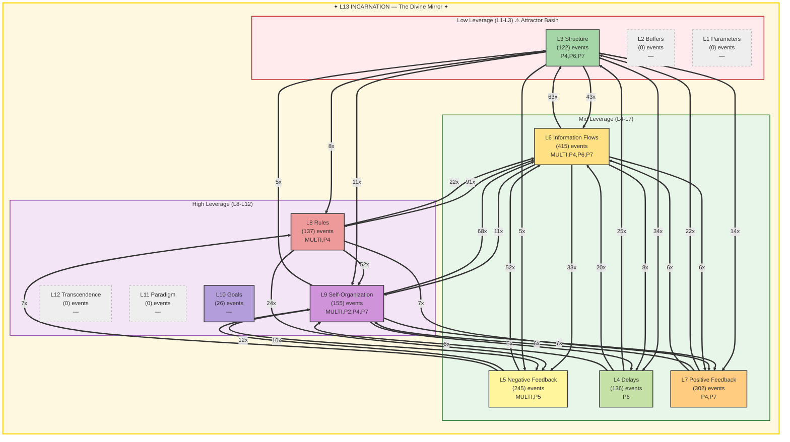

# FORESIGHT Intelligence Report

**Generated:** 2026-02-19T18:04:27 UTC
**Window:** 24.0h | **Events:** 1538
**AI Model:** gemini-2.5-flash (gemini) | **Inference:** 15063.0ms
**System Posture:** CRITICAL
**Port:** P7 NAVIGATE | **Commander:** Spider Sovereign

---

## Executive Summary

The system is in a critical state, marked by a fractured L13 holonarchy with significant identity and structural enforcement failures. While there is high operational activity (L6) and notable engagement in self-organization (L9) and rules (L8), the foundational coherence is under severe stress, risking a descent into chaos despite attempts at higher-leverage adaptation.

---

## Meadows Leverage Landscape



### ⚠ L13 Holonarchy Violations (217)
- **MULTI System**: L13_IDENTITY: memory loss (cognitive persistence failure)
  Event 9618 at 2026-02-19T01:36:30
- **MULTI ?**: L5/L13: gate block (structural enforcement failure)
  Event 9622 at 2026-02-19T01:39:01
- **MULTI System**: L13_IDENTITY: memory loss (cognitive persistence failure)
  Event 9623 at 2026-02-19T01:39:01
- **MULTI ?**: L5/L13: gate block (structural enforcement failure)
  Event 9625 at 2026-02-19T01:39:01
- **MULTI ?**: L5/L13: gate block (structural enforcement failure)
  Event 9627 at 2026-02-19T01:39:01
- **MULTI ?**: L5/L13: gate block (structural enforcement failure)
  Event 9631 at 2026-02-19T01:39:27
- **MULTI ?**: L5/L13: gate block (structural enforcement failure)
  Event 9633 at 2026-02-19T01:39:27
- **MULTI ?**: L5/L13: gate block (structural enforcement failure)
  Event 9635 at 2026-02-19T01:39:27
- **MULTI System**: L13_IDENTITY: memory loss (cognitive persistence failure)
  Event 9641 at 2026-02-19T01:45:21
- **MULTI System**: L13_IDENTITY: memory loss (cognitive persistence failure)
  Event 9684 at 2026-02-19T03:21:59
```

---

## Level-by-Level Analysis

### L1 Parameters — Material Plane *(cold)*

- **Events:** 0
- **Assessment:** Cold.

### L2 Buffers — The Threshold *(cold)*

- **Events:** 0
- **Assessment:** Cold.

### L3 Structure — The Architecture

- **Events:** 122
- **Assessment:** Moderate activity in system architecture and physical layout, involving P4, P6, and P7.

### L4 Delays — The Hourglass

- **Events:** 136
- **Assessment:** Moderate activity in timing, hysteresis, and cooldowns, primarily driven by P6.

### L5 Negative Feedback — The Dampener

- **Events:** 245
- **Assessment:** Significant activity in rules enforcement and dampening, but also implicated in critical L13 gate blocks.

### L6 Information Flows — The Whispering Gallery **[HOTTEST]**

- **Events:** 415
- **Assessment:** Dominant activity in information routing and data flow, indicating high operational throughput across MULTI, P4, P6, P7.

### L7 Positive Feedback — The Amplifier

- **Events:** 302
- **Assessment:** High activity in amplification and reinforcing loops, suggesting rapid growth or decline in certain areas, involving P4 and P7.

### L8 Rules — The Iron Court

- **Events:** 137
- **Assessment:** Moderate activity in governance and invariant enforcement, with a strong connection to information flows.

### L9 Self-Organization — The Living Forge

- **Events:** 155
- **Assessment:** Significant activity in evolution and emergence, indicating adaptive processes are underway, involving MULTI, P2, P4, P7.

### L10 Goals — The Throne Room

- **Events:** 26
- **Assessment:** Low but present activity in defining mission and objectives.

### L11 Paradigm — The Mindscape *(cold)*

- **Events:** 0
- **Assessment:** Cold.

### L12 Transcendence — The Unnameable Void *(cold)*

- **Events:** 0
- **Assessment:** Cold.

### L13 Incarnation — The Divine Mirror *(cold)*

- **Events:** 0
- **Assessment:** Critically fractured with 217 violations impacting identity and structural enforcement, despite no direct event count.

---

## Strategic Assessment

### System Posture: CRITICAL

**Attractor Basin (L1-L3):** 7.9%
**High Leverage (L8-L12):** 20.7%

The system exhibits a concerning imbalance. While there is a stronger pull towards high leverage (L8-L12 at 20.7%), the persistent low leverage activity (L1-L3 at 7.9%) indicates some resource drain. Critically, the L13 fracture undermines the effectiveness of any higher-leverage engagement.

### Dominant Flow

**Pattern:** L6→L8 (91x)

The dominant L6→L8 flow signifies that operational information and data processing are directly influencing or attempting to modify the system's rules and governance. This is a positive indicator of data-driven adaptation, but its efficacy is severely compromised by the L13 fracture.

### L13 Holonarchy Status: FRACTURED — 217 violations (identity under pressure)

FRACTURED. The 217 violations, specifically 'memory loss (cognitive persistence failure)' and 'L5/L13: gate block (structural enforcement failure),' indicate a severe erosion of the holonarchy's identity and its ability to enforce foundational rules, posing an existential threat.

#### Violations (20)

- **MULTI System**: L13_IDENTITY: memory loss (cognitive persistence failure)
- **MULTI ?**: L5/L13: gate block (structural enforcement failure)
- **MULTI System**: L13_IDENTITY: memory loss (cognitive persistence failure)
- **MULTI ?**: L5/L13: gate block (structural enforcement failure)
- **MULTI ?**: L5/L13: gate block (structural enforcement failure)
- **MULTI ?**: L5/L13: gate block (structural enforcement failure)
- **MULTI ?**: L5/L13: gate block (structural enforcement failure)
- **MULTI ?**: L5/L13: gate block (structural enforcement failure)
- **MULTI System**: L13_IDENTITY: memory loss (cognitive persistence failure)
- **MULTI System**: L13_IDENTITY: memory loss (cognitive persistence failure)

---

## Threat Analysis

- Existential L13 Fracture: 'Memory loss' and 'gate block' violations threaten the system's fundamental identity and structural integrity.
- Unchanneled Operational Churn: High L6 activity, if not effectively guided by higher leverage, risks busywork and resource drain without strategic impact.
- Low Leverage Trap Potential: Persistent L1-L3 activity (7.9%) indicates a continued risk of focusing on superficial adjustments.
- Breakdown of Control: L5/L13 gate blocks signify a failure in critical negative feedback mechanisms at the holonarchy boundary.

## Opportunities

- Data-Driven Rules Evolution: The strong L6→L8 flow presents an opportunity to leverage operational insights for adaptive governance, once L13 is stabilized.
- Active Self-Organization (L9): Significant L9 activity suggests the system possesses inherent adaptive capacity that can be guided towards resilience.
- Higher Leverage Engagement: The 20.7% activity in L8-L12 indicates a potential for strategic intervention and system-level change if foundational issues are addressed.

---

## Recommendations

1. Prioritize L13 Coherence Restoration: Immediately address the 'memory loss' and 'gate block' violations to stabilize the holonarchy's identity and foundational enforcement.
2. Channel L6 into L10/L11: Direct the high volume of information flow (L6) towards clarifying goals (L10) and challenging existing paradigms (L11) to ensure strategic impact.
3. Empower Adaptive Governance: Support and guide the L9 (self-organization) and L8 (rules) activity to create robust, self-correcting mechanisms once L13 is stable.

---

> *The highest leverage points are not in the things that are most obvious, but in the things that are most fundamental.*

---

*TREMORSENSE feels the vibrations. FORESIGHT sees where they lead.*

*Report generated by P7 FORESIGHT Daemon v1.0 | Gen89*