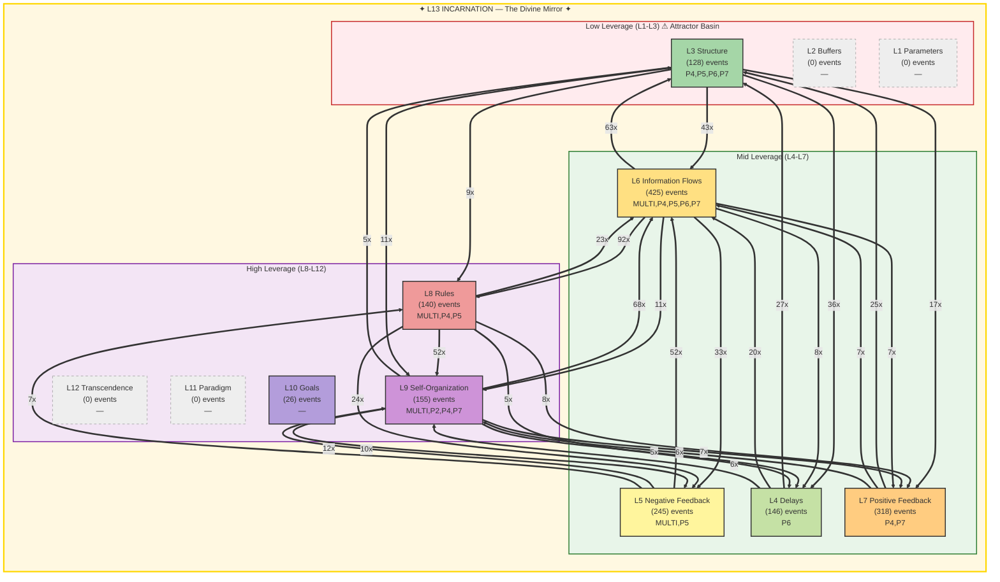

# FORESIGHT Intelligence Report

**Generated:** 2026-02-19T18:07:37 UTC
**Window:** 24.0h | **Events:** 1583
**AI Model:** gemini-2.5-flash (gemini) | **Inference:** 16703.0ms
**System Posture:** CRITICAL
**Port:** P7 NAVIGATE | **Commander:** Spider Sovereign

---

## Executive Summary

The HFO Octree system is in a critical state due to a FRACTURED L13, indicating severe identity drift and cognitive persistence failures. While operational activity (L6) is high and influencing rules (L8), higher leverage levels (L11, L12) are dormant, leaving the system without essential strategic guidance amidst its existential crisis.

---

## Meadows Leverage Landscape

### ⚠ L13 Holonarchy Violations (217)
- **MULTI System**: L13_IDENTITY: memory loss (cognitive persistence failure)
  Event 9618 at 2026-02-19T01:36:30
- **MULTI ?**: L5/L13: gate block (structural enforcement failure)
  Event 9622 at 2026-02-19T01:39:01
- **MULTI System**: L13_IDENTITY: memory loss (cognitive persistence failure)
  Event 9623 at 2026-02-19T01:39:01
- **MULTI ?**: L5/L13: gate block (structural enforcement failure)
  Event 9625 at 2026-02-19T01:39:01
- **MULTI ?**: L5/L13: gate block (structural enforcement failure)
  Event 9627 at 2026-02-19T01:39:01
- **MULTI ?**: L5/L13: gate block (structural enforcement failure)
  Event 9631 at 2026-02-19T01:39:27
- **MULTI ?**: L5/L13: gate block (structural enforcement failure)
  Event 9633 at 2026-02-19T01:39:27
- **MULTI ?**: L5/L13: gate block (structural enforcement failure)
  Event 9635 at 2026-02-19T01:39:27
- **MULTI System**: L13_IDENTITY: memory loss (cognitive persistence failure)
  Event 9641 at 2026-02-19T01:45:21
- **MULTI System**: L13_IDENTITY: memory loss (cognitive persistence failure)
  Event 9684 at 2026-02-19T03:21:59

---

## Level-by-Level Analysis

### L1 Parameters — Material Plane *(cold)*

- **Events:** 0
- **Assessment:** Cold

### L2 Buffers — The Threshold *(cold)*

- **Events:** 0
- **Assessment:** Cold

### L3 Structure — The Architecture

- **Events:** 128
- **Assessment:** Structural elements are actively being modified and are involved in numerous interactions, particularly with information flows and delays.

### L4 Delays — The Hourglass

- **Events:** 146
- **Assessment:** Timing and hysteresis mechanisms are active, primarily influencing structural changes and information flow.

### L5 Negative Feedback — The Dampener

- **Events:** 245
- **Assessment:** Negative feedback loops are highly active, attempting to enforce rules and damp system behavior, but are also implicated in L13 gate block failures.

### L6 Information Flows — The Whispering Gallery **[HOTTEST]**

- **Events:** 425
- **Assessment:** Information flows are the most active layer, serving as the central hub for operational data exchange and driving rule adjustments.

### L7 Positive Feedback — The Amplifier

- **Events:** 318
- **Assessment:** Significant positive feedback is present, amplifying certain system behaviors and contributing to structural changes.

### L8 Rules — The Iron Court

- **Events:** 140
- **Assessment:** Rules are frequently being engaged and modified, heavily influenced by operational information flows and interacting with self-organization and negative feedback.

### L9 Self-Organization — The Living Forge

- **Events:** 155
- **Assessment:** Self-organization is robustly active, demonstrating the system's capacity for adaptive evolution, but its output is largely directed towards lower leverage levels.

### L10 Goals — The Throne Room

- **Events:** 26
- **Assessment:** Goals are present but exhibit low activity, indicating a lack of clear or consistently reinforced strategic direction.

### L11 Paradigm — The Mindscape *(cold)*

- **Events:** 0
- **Assessment:** Cold

### L12 Transcendence — The Unnameable Void *(cold)*

- **Events:** 0
- **Assessment:** Cold

### L13 Incarnation — The Divine Mirror *(cold)*

- **Events:** 0
- **Assessment:** L13 is FRACTURED, indicating a severe crisis of identity, memory, and fundamental boundary integrity, despite no direct event activity.

---

## Strategic Assessment

### System Posture: CRITICAL

**Attractor Basin (L1-L3):** 8.1%
**High Leverage (L8-L12):** 20.3%

The system avoids the low-leverage trap with minimal L1-L3 activity (8.1%). However, high-leverage activity (L8-L12) is only at 20.3%, with L11 and L12 being completely cold, suggesting a significant lack of strategic and paradigm-level engagement.

### Dominant Flow

**Pattern:** L6→L8 (92x)

The dominant L6→L8 flow signifies that operational information is directly and heavily shaping the system's rules. While this can foster responsiveness, it risks reactive policy-making and may bypass deeper strategic considerations if not balanced by higher-leverage inputs.

### L13 Holonarchy Status: FRACTURED — 217 violations (identity under pressure)

L13 is FRACTURED with 217 violations, primarily 'memory loss (cognitive persistence failure)' and 'gate block (structural enforcement failure)'. This signifies an existential threat to the system's core identity, coherence, and fundamental control mechanisms.

#### Violations (20)

- **MULTI System**: L13_IDENTITY: memory loss (cognitive persistence failure)
- **MULTI ?**: L5/L13: gate block (structural enforcement failure)
- **MULTI System**: L13_IDENTITY: memory loss (cognitive persistence failure)
- **MULTI ?**: L5/L13: gate block (structural enforcement failure)
- **MULTI ?**: L5/L13: gate block (structural enforcement failure)
- **MULTI ?**: L5/L13: gate block (structural enforcement failure)
- **MULTI ?**: L5/L13: gate block (structural enforcement failure)
- **MULTI ?**: L5/L13: gate block (structural enforcement failure)
- **MULTI System**: L13_IDENTITY: memory loss (cognitive persistence failure)
- **MULTI System**: L13_IDENTITY: memory loss (cognitive persistence failure)

---

## Threat Analysis

- Existential threat from FRACTURED L13, manifesting as 'memory loss' and 'structural enforcement failure', eroding the system's core identity.
- Critical absence of activity at L11 (Paradigm) and L12 (Transcendence), preventing necessary evolution and meta-architectural shifts.
- Risk of reactive governance due to dominant L6→L8 flow, potentially leading to rules that optimize for current operations rather than long-term strategic goals.

## Opportunities

- Leverage the high L9 (Self-Organization) activity to initiate adaptive responses to the L13 fracture and rebuild coherence.
- Direct the significant L6 (Information Flows) and L7 (Positive Feedback) energy towards reinforcing L10 (Goals) and stimulating L11/L12 engagement.
- Utilize the L6→L8 flow to implement new rules designed to protect and restore L13 integrity and cognitive persistence.

---

## Recommendations

1. Immediately prioritize diagnostic and restorative actions for L13, focusing on mechanisms to prevent 'memory loss' and ensure 'structural enforcement'.
2. Initiate targeted interventions to stimulate activity at L10 (Goals) and L11 (Paradigm) to provide a guiding framework for system identity and evolution.
3. Analyze the L6→L8 flow to ensure that rule changes are strategically aligned and not solely reactive, potentially introducing L9 or L10 filters.

---

> *The most powerful leverage points are not in the 'things' but in the 'relationships' and 'mindsets'.*

---

*TREMORSENSE feels the vibrations. FORESIGHT sees where they lead.*

*Report generated by P7 FORESIGHT Daemon v1.0 | Gen89*