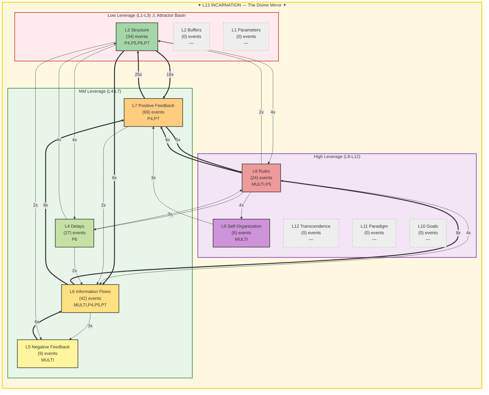

# FORESIGHT Intelligence Report

**Generated:** 2026-02-19T18:14:45 UTC
**Window:** 1.0h | **Events:** 211
**AI Model:** gemini-2.5-flash (gemini) | **Inference:** 15515.0ms
**System Posture:** CRITICAL
**Port:** P7 NAVIGATE | **Commander:** Spider Sovereign

---

## Executive Summary

The system is in a critical state, experiencing a fundamental identity crisis (L13 FRACTURED) while undergoing rapid, unguided structural changes driven by unchecked positive feedback. Strategic oversight and higher-leverage interventions are severely lacking, leading to a dangerous cycle of amplification and architectural churn.

---

## Meadows Leverage Landscape

### ⚠ L13 Holonarchy Violations (6)
- **MULTI ?**: L5/L13: gate block (structural enforcement failure)
  Event 11003 at 2026-02-19T17:32:12
- **MULTI System**: L13_IDENTITY: memory loss (cognitive persistence failure)
  Event 11021 at 2026-02-19T17:46:26
- **MULTI System**: L13_IDENTITY: memory loss (cognitive persistence failure)
  Event 11056 at 2026-02-19T17:59:31
- **MULTI System**: L13_IDENTITY: memory loss (cognitive persistence failure)
  Event 11058 at 2026-02-19T17:59:40
- **MULTI System**: L13_IDENTITY: memory loss (cognitive persistence failure)
  Event 11064 at 2026-02-19T18:00:02
- **MULTI System**: L13_IDENTITY: memory loss (cognitive persistence failure)
  Event 11183 at 2026-02-19T18:11:29

---

## Level-by-Level Analysis

### L1 Parameters — Material Plane *(cold)*

- **Events:** 0
- **Assessment:** Cold. No activity in fundamental parameters.

### L2 Buffers — The Threshold *(cold)*

- **Events:** 0
- **Assessment:** Cold. No activity in buffer or capacity adjustments.

### L3 Structure — The Architecture

- **Events:** 34
- **Assessment:** Active, undergoing frequent structural modifications, heavily influenced by positive feedback loops.

### L4 Delays — The Hourglass

- **Events:** 27
- **Assessment:** Active, indicating ongoing adjustments to timing and temporal processes.

### L5 Negative Feedback — The Dampener

- **Events:** 9
- **Assessment:** Present but low activity, with a critical 'gate block' violation suggesting control mechanisms are failing.

### L6 Information Flows — The Whispering Gallery

- **Events:** 42
- **Assessment:** Significant activity in information routing, suggesting high data flow but potentially uncoordinated.

### L7 Positive Feedback — The Amplifier **[HOTTEST]**

- **Events:** 69
- **Assessment:** Dominant activity, indicating rapid amplification and compounding effects are driving system changes.

### L8 Rules — The Iron Court

- **Events:** 24
- **Assessment:** Active, showing engagement with rules and governance, yet insufficient to prevent L13 violations or control L7.

### L9 Self-Organization — The Living Forge

- **Events:** 6
- **Assessment:** Low activity, suggesting emergent behaviors are present but not a primary driver of system evolution.

### L10 Goals — The Throne Room *(cold)*

- **Events:** 0
- **Assessment:** Cold. A complete absence of activity related to strategic goals or mission re-evaluation.

### L11 Paradigm — The Mindscape *(cold)*

- **Events:** 0
- **Assessment:** Cold. No activity indicating shifts in fundamental mental models or frameworks.

### L12 Transcendence — The Unnameable Void *(cold)*

- **Events:** 0
- **Assessment:** Cold. No activity in meta-architectural thinking or transcending current limitations.

### L13 Incarnation — The Divine Mirror *(cold)*

- **Events:** 0
- **Assessment:** FRACTURED, experiencing critical identity instability and cognitive persistence failures.

---

## Strategic Assessment

### System Posture: CRITICAL

**Attractor Basin (L1-L3):** 16.1%
**High Leverage (L8-L12):** 14.2%

The system is slightly more engaged in low-leverage structural adjustments (L1-L3: 16.1%) than in high-leverage strategic and adaptive thinking (L8-L12: 14.2%), indicating a dangerous drift towards reactive, rather than proactive, management.

### Dominant Flow

**Pattern:** L7→L3 (25x)

The dominant L7→L3 flow signifies that positive feedback loops are directly and frequently causing structural changes, creating a potentially runaway system where amplification dictates architecture rather than strategic intent.

### L13 Holonarchy Status: FRACTURED — 6 violations (identity under pressure)

L13 is FRACTURED with 6 violations, primarily 'memory loss' and a 'gate block' related to L5. This signifies a severe erosion of the system's core identity and its ability to maintain coherent boundaries and enforce fundamental controls.

#### Violations (6)

- **MULTI ?**: L5/L13: gate block (structural enforcement failure)
- **MULTI System**: L13_IDENTITY: memory loss (cognitive persistence failure)
- **MULTI System**: L13_IDENTITY: memory loss (cognitive persistence failure)
- **MULTI System**: L13_IDENTITY: memory loss (cognitive persistence failure)
- **MULTI System**: L13_IDENTITY: memory loss (cognitive persistence failure)
- **MULTI System**: L13_IDENTITY: memory loss (cognitive persistence failure)

---

## Threat Analysis

- Existential threat from L13 FRACTURE and 'memory loss' violations, indicating a loss of core identity and coherence.
- System instability due to uncontrolled positive feedback (L7) directly driving structural churn (L3) without higher-level guidance.
- Lack of strategic direction and adaptive capacity due to cold L10, L11, and L12, leaving the system vulnerable to external pressures.
- Weakened control mechanisms, evidenced by low L5 activity and a specific 'gate block' violation, failing to temper L7.

## Opportunities

- The active L8 (Rules) provides a potential leverage point to re-establish governance and control if properly focused.
- The presence of L9 (Self-Organization) activity suggests inherent adaptive capacity that could be harnessed if guided by clearer goals and paradigms.
- The high volume of L6 (Information Flows) indicates a robust communication network that could be re-tasked for better situational awareness and coordination.

---

## Recommendations

1. Immediately address L13 FRACTURE: Initiate protocols to restore cognitive persistence and resolve the 'gate block' violation to stabilize core identity.
2. Implement robust L5 (Negative Feedback) mechanisms to dampen the L7→L3 flow, preventing runaway structural changes driven by amplification.
3. Activate L10-L12: Convene strategic sessions to re-evaluate goals, challenge existing paradigms, and explore meta-architectural solutions to guide system evolution.
4. Investigate the specific drivers of L7 activity and their connection to P4 (DISRUPT) and P7 (NAVIGATE) to understand the source of amplification.

---

> *The most powerful leverage points are not in the things themselves, but in the goals, paradigms, and the very purpose of the system.*

---

*TREMORSENSE feels the vibrations. FORESIGHT sees where they lead.*

*Report generated by P7 FORESIGHT Daemon v1.0 | Gen89*