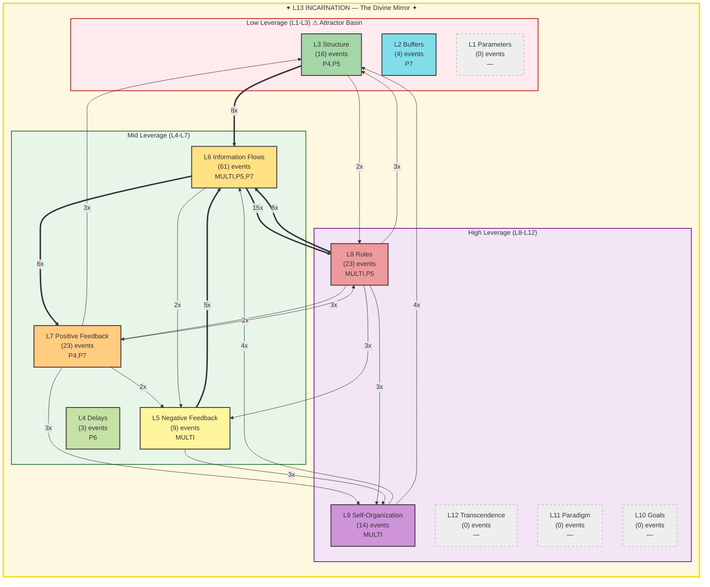

# Summoner Intelligence Report — Seals & Spheres

**Generated:** 2026-02-19T20:46:36 UTC
**Port:** P7 NAVIGATE | **Commander:** Spider Sovereign | **Spell:** TIME STOP
**AI Model:** deterministic (fallback_deterministic) | **Inference:** 0ms
**System Posture:** STRESSED
**Trio:** Singer (P4) + Dancer (P5) + Summoner (P7)

> *Seals without Spheres is imprisonment. Spheres without Seals is chaos.*

---

## SEAL — Constraint Recommendation

| Field | Value |
|-------|-------|
| **Spell** | DIMENSIONAL_ANCHOR |
| **Target** | Gate protocol drift — agents not completing PREY8 loop |
| **Meadows Level** | L8 |
| **Reason** | 174 gate blocks in last hour |

---

## SPHERE — Frontier Recommendation

| Field | Value |
|-------|-------|
| **Spell** | POLYMORPH_ANY_OBJECT |
| **Target** | 7676 docs without port assignment — reshape for octree integration |
| **Meadows Level** | L9 |
| **Reason** | Majority of corpus unrouted — port enrichment unlocks the octree |

---

## Landscape Assessment

Deterministic assessment: 9861 docs, 1902 events/h, 7676 unrouted. STRESSED posture.

### Trio Coherence

No AI — cannot assess trio alignment.

### Strange Loop Reflection

No AI — cannot reflect on past seals/spheres.

---

## Meadows Leverage Landscape

### ⚠ L13 Holonarchy Violations (5)
- **MULTI System**: L13_IDENTITY: memory loss (cognitive persistence failure)
  Event 11362 at 2026-02-19T20:01:04
- **MULTI System**: L13_IDENTITY: memory loss (cognitive persistence failure)
  Event 11374 at 2026-02-19T20:17:25
- **MULTI System**: L13_IDENTITY: memory loss (cognitive persistence failure)
  Event 11391 at 2026-02-19T20:26:44
- **MULTI System**: L13_IDENTITY: memory loss (cognitive persistence failure)
  Event 11393 at 2026-02-19T20:26:55
- **MULTI System**: L13_IDENTITY: memory loss (cognitive persistence failure)
  Event 11397 at 2026-02-19T20:27:55

---

## Cartography Data

| Metric | Value |
|--------|-------|
| Events classified | 153 / 153 |
| Hottest level | L6 (61 events) |
| Attractor basin (L1-L3) | 13.1% |
| High leverage (L8-L12) | 24.2% |
| L13 status | FRACTURED — 5 violations (identity under pressure) |
| Active levels | [2, 3, 4, 5, 6, 7, 8, 9] |
| Cold levels | [1, 10, 11, 12, 13] |

---

## SSOT Health Snapshot

| Metric | Value |
|--------|-------|
| Total docs | 9861 |
| Total events | 11492 |
| Events/1h | 1902 |
| Docs without port | 7676 |
| Perceives/1h | 166 |
| Yields/1h | 157 |
| Gate blocked/1h | 174 |
| Memory loss/1h | 55 |

---

> *"The Tao gives birth to One. One gives birth to Two. Two gives birth to Three. Three gives birth to Ten Thousand Things. — Lao Tzu, Ch. 42"*

---

*SUMMONER OF SILK AND SOVEREIGNTY — Silk IS sovereignty — the web you wove IS your authority*

*Report generated by P7 Summoner of Seals and Spheres v1.0 | Gen89*