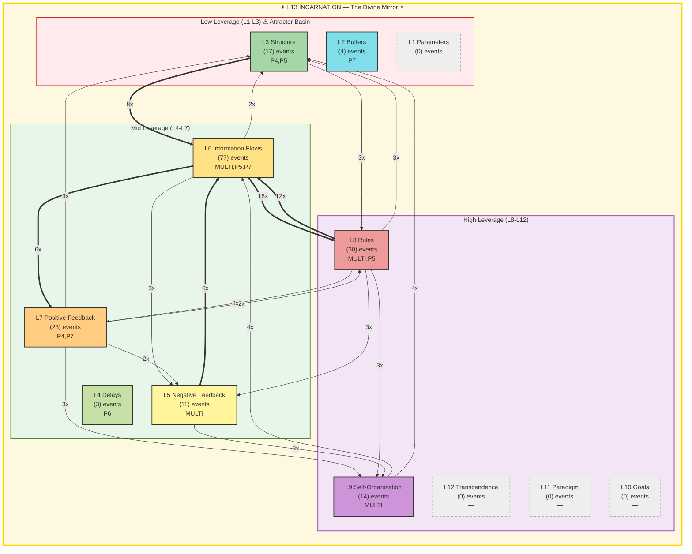

# Summoner Intelligence Report — Seals & Spheres

**Generated:** 2026-02-19T20:52:10 UTC
**Port:** P7 NAVIGATE | **Commander:** Spider Sovereign | **Spell:** TIME STOP
**AI Model:** gemini-2.5-flash (gemini) | **Inference:** 24140.0ms
**System Posture:** CRITICAL
**Trio:** Singer (P4) + Dancer (P5) + Summoner (P7)

> *Seals without Spheres is imprisonment. Spheres without Seals is chaos.*

---

## SEAL — Constraint Recommendation

| Field | Value |
|-------|-------|
| **Spell** | IMPRISONMENT |
| **Target** | The 'dead component' antipattern identified by P5 Dancer, which is the persistent source of the 175 'gate_blocked' events per hour and the L5/L13 structural enforcement failure. |
| **Meadows Level** | L8 |
| **Reason** | The critical and persistent rate of 'gate_blocked' events, explicitly called a 'dead component' by Dancer and a 'POWERWORD_KILL' by Singer, indicates a fundamental antipattern that a previous DIMENSIONAL_ANCHOR failed to resolve. This requires permanent neutralization to prevent further system fracturing. |

---

## SPHERE — Frontier Recommendation

| Field | Value |
|-------|-------|
| **Spell** | FORESIGHT |
| **Target** | Establishing a resilient and comprehensive strategy for document classification, routing, and cognitive persistence, specifically addressing the massive 'No port' corpus (7676 documents) and the recurring 'memory_loss' L13 violations. |
| **Meadows Level** | L10 |
| **Reason** | With the primary blocking mechanism targeted for permanent removal, the system must now proactively define its strategic goals for processing the immense backlog of unrouted documents and ensuring long-term cognitive integrity to prevent future 'memory_loss' and 'No port' issues. This activates the currently cold L10 (Goals) level. |

---

## Landscape Assessment

The system is in a critical state, marked by a FRACTURED L13 status due to persistent gate blocks and memory loss, indicating severe identity and structural enforcement failures. While information flows (L6) are active, higher leverage levels (L10-L12) remain cold, signaling a lack of strategic direction amidst the operational chaos.

### Trio Coherence

High. Singer and Dancer are in strong agreement on the critical nature of the gate blocking, identifying it as a 'POWERWORD_KILL' and a 'dead component' requiring purging. The Summoner's SEAL directly targets this core issue with a permanent solution. The SPHERE addresses the systemic consequences and future resilience, aligning with the need for strategic recovery.

### Strange Loop Reflection

My previous DIMENSIONAL_ANCHOR on gate blocks proved insufficient, highlighting that some antipatterns require the permanent sealing of IMPRISONMENT rather than mere anchoring. The POLYMORPH_ANY_OBJECT sphere for unrouted corpus was premature; addressing the fundamental blocking mechanism is a prerequisite for effective transformation.

---

## Meadows Leverage Landscape

### ⚠ L13 Holonarchy Violations (7)
- **MULTI System**: L13_IDENTITY: memory loss (cognitive persistence failure)
  Event 11362 at 2026-02-19T20:01:04
- **MULTI System**: L13_IDENTITY: memory loss (cognitive persistence failure)
  Event 11374 at 2026-02-19T20:17:25
- **MULTI System**: L13_IDENTITY: memory loss (cognitive persistence failure)
  Event 11391 at 2026-02-19T20:26:44
- **MULTI System**: L13_IDENTITY: memory loss (cognitive persistence failure)
  Event 11393 at 2026-02-19T20:26:55
- **MULTI System**: L13_IDENTITY: memory loss (cognitive persistence failure)
  Event 11397 at 2026-02-19T20:27:55
- **MULTI ?**: L5/L13: gate block (structural enforcement failure)
  Event 11515 at 2026-02-19T20:50:09
- **MULTI System**: L13_IDENTITY: memory loss (cognitive persistence failure)
  Event 11516 at 2026-02-19T20:50:17

---

## Cartography Data

| Metric | Value |
|--------|-------|
| Events classified | 179 / 179 |
| Hottest level | L6 (77 events) |
| Attractor basin (L1-L3) | 11.7% |
| High leverage (L8-L12) | 24.6% |
| L13 status | FRACTURED — 7 violations (identity under pressure) |
| Active levels | [2, 3, 4, 5, 6, 7, 8, 9] |
| Cold levels | [1, 10, 11, 12, 13] |

---

## SSOT Health Snapshot

| Metric | Value |
|--------|-------|
| Total docs | 9861 |
| Total events | 11519 |
| Events/1h | 1929 |
| Docs without port | 7676 |
| Perceives/1h | 167 |
| Yields/1h | 157 |
| Gate blocked/1h | 175 |
| Memory loss/1h | 56 |

---

> *"The Tao gives birth to One. One gives birth to Two. Two gives birth to Three. Three gives birth to Ten Thousand Things. — Lao Tzu, Ch. 42"*

---

*SUMMONER OF SILK AND SOVEREIGNTY — Silk IS sovereignty — the web you wove IS your authority*

*Report generated by P7 Summoner of Seals and Spheres v1.0 | Gen89*