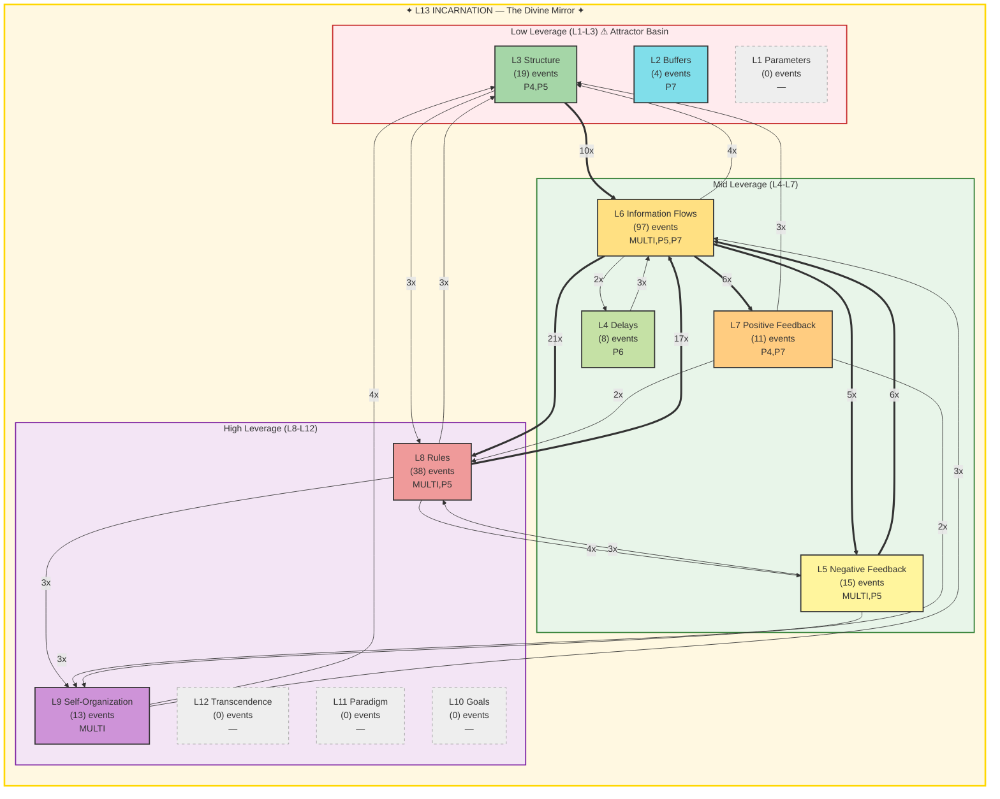

# Summoner Intelligence Report — Seals & Spheres

**Generated:** 2026-02-19T21:07:23 UTC
**Port:** P7 NAVIGATE | **Commander:** Spider Sovereign | **Spell:** TIME STOP
**AI Model:** gemini-2.5-flash (gemini) | **Inference:** 20875.0ms
**System Posture:** CRITICAL
**Trio:** Singer (P4) + Dancer (P5) + Summoner (P7)

> *Seals without Spheres is imprisonment. Spheres without Seals is chaos.*

---

## SEAL — Constraint Recommendation

| Field | Value |
|-------|-------|
| **Spell** | IMPRISONMENT |
| **Target** | The 'dead component' identified by P5 Dancer that is causing gate blocking events and contributing to L13 fractures. |
| **Meadows Level** | L8 |
| **Reason** | P5 Dancer explicitly identifies a 'dead component' that continues to cause strife, specifically gate blocking events which are at a critical level (175/hr) and directly contributing to L13 Incarnation fractures. This antipattern must be permanently sealed to halt system degradation. |

---

## SPHERE — Frontier Recommendation

| Field | Value |
|-------|-------|
| **Spell** | ETHEREAL_JAUNT |
| **Target** | Re-establish a coherent L13 Incarnation and system identity by addressing the root causes of memory loss and L13 fractures. |
| **Meadows Level** | L11 |
| **Reason** | The system's L13 Incarnation is fractured with 8 violations, including persistent memory loss and identity under pressure. The highest leverage levels (L10-L12) are cold. A paradigm shift is required to re-align the system's core principles, resolve identity inconsistencies, and enable higher-level goal setting and transcendence. |

---

## Landscape Assessment

The system is experiencing critical L13 Incarnation fractures due to persistent memory loss and gate blocking events, despite active information flows (L6) and rule enforcement (L8). High leverage levels (L10-L12) remain cold, indicating a lack of strategic vision or coherent paradigm amidst the crisis.

### Trio Coherence

Singer identifies critical gate blocking strife. Dancer confirms the severity and provides a crucial insight into a 'dead component' as a root cause, recommending immediate action. Summoner's SEAL directly targets this identified 'dead component', demonstrating strong alignment on the immediate threat and its underlying cause.

### Strange Loop Reflection

My previous DIMENSIONAL_ANCHOR on gate blocks addressed the symptom but did not resolve the underlying cause. This highlights the necessity of listening for deeper insights (like Dancer's 'dead component') to move from symptom management to root cause elimination, especially when L13 integrity is compromised.

---

## Meadows Leverage Landscape

### ⚠ L13 Holonarchy Violations (8)
- **MULTI System**: L13_IDENTITY: memory loss (cognitive persistence failure)
  Event 11374 at 2026-02-19T20:17:25
- **MULTI System**: L13_IDENTITY: memory loss (cognitive persistence failure)
  Event 11391 at 2026-02-19T20:26:44
- **MULTI System**: L13_IDENTITY: memory loss (cognitive persistence failure)
  Event 11393 at 2026-02-19T20:26:55
- **MULTI System**: L13_IDENTITY: memory loss (cognitive persistence failure)
  Event 11397 at 2026-02-19T20:27:55
- **MULTI ?**: L5/L13: gate block (structural enforcement failure)
  Event 11515 at 2026-02-19T20:50:09
- **MULTI System**: L13_IDENTITY: memory loss (cognitive persistence failure)
  Event 11516 at 2026-02-19T20:50:17
- **P5 Pyre Praetorian**: L5/L13: gate block (structural enforcement failure)
  Event 11558 at 2026-02-19T21:03:56
- **P5 Pyre Praetorian**: L5/L13: gate block (structural enforcement failure)
  Event 11567 at 2026-02-19T21:06:00

---

## Cartography Data

| Metric | Value |
|--------|-------|
| Events classified | 205 / 205 |
| Hottest level | L6 (97 events) |
| Attractor basin (L1-L3) | 11.2% |
| High leverage (L8-L12) | 24.9% |
| L13 status | FRACTURED — 8 violations (identity under pressure) |
| Active levels | [2, 3, 4, 5, 6, 7, 8, 9] |
| Cold levels | [1, 10, 11, 12, 13] |

---

## SSOT Health Snapshot

| Metric | Value |
|--------|-------|
| Total docs | 9861 |
| Total events | 11568 |
| Events/1h | 1978 |
| Docs without port | 7675 |
| Perceives/1h | 167 |
| Yields/1h | 158 |
| Gate blocked/1h | 175 |
| Memory loss/1h | 56 |

---

> *"The Tao gives birth to One. One gives birth to Two. Two gives birth to Three. Three gives birth to Ten Thousand Things. — Lao Tzu, Ch. 42"*

---

*SUMMONER OF SILK AND SOVEREIGNTY — Silk IS sovereignty — the web you wove IS your authority*

*Report generated by P7 Summoner of Seals and Spheres v1.0 | Gen89*