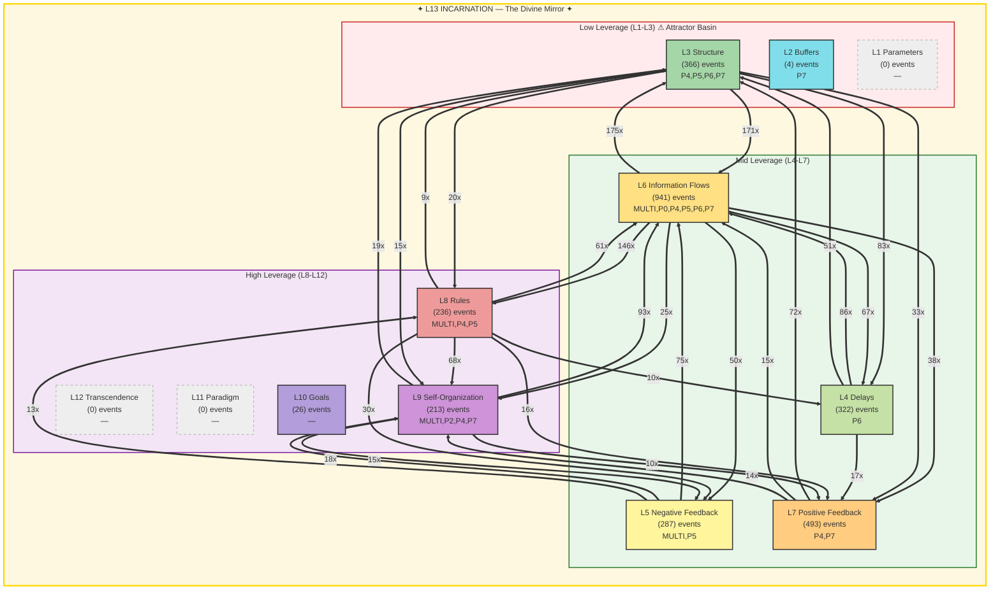

# Summoner Intelligence Report — Seals & Spheres

**Generated:** 2026-02-19T23:29:27 UTC
**Port:** P7 NAVIGATE | **Commander:** Spider Sovereign | **Spell:** TIME STOP
**AI Model:** gemini-2.5-flash (gemini) | **Inference:** 25141.0ms
**System Posture:** STRESSED
**Trio:** Singer (P4) + Dancer (P5) + Summoner (P7)

> *Seals without Spheres is imprisonment. Spheres without Seals is chaos.*

---

## SEAL — Constraint Recommendation

| Field | Value |
|-------|-------|
| **Spell** | IMPRISONMENT |
| **Target** | The source of 'Tamper alerts' (31/1h), which are active integrity violations. |
| **Meadows Level** | L8 |
| **Reason** | Dancer explicitly identifies 'Tamper alerts' as an 'active integrity violation' requiring a 'PRISMATIC_WALL' (DEATH), indicating a critical threat to the system's sovereignty that must be permanently sealed. This directly contributes to the L13 FRACTURED state. |

---

## SPHERE — Frontier Recommendation

| Field | Value |
|-------|-------|
| **Spell** | ETHEREAL_JAUNT |
| **Target** | The current paradigm for document routing and classification that leaves 77% of documents unrouted ('No port'). |
| **Meadows Level** | L11 |
| **Reason** | The persistent and massive backlog of unrouted documents (77%) indicates a fundamental flaw in the system's current processing paradigm. A shift in this paradigm (L11) is required to unlock this vast untapped potential and fully integrate system inputs. |

---

## Landscape Assessment

The system is grappling with a fractured L13 Incarnation (241 violations) and active integrity breaches (tamper alerts). While Information Flows (L6) are robust, a significant 77% of documents remain unrouted, indicating a core inefficiency and a dormant L11 Paradigm level.

### Trio Coherence

Singer highlights gate blocks and successful yields. Dancer calls for protection against memory loss and sealing tamper alerts. Summoner's choices directly address Dancer's critical warnings (tamper alerts) and a persistent, high-leverage inefficiency (unrouted documents), showing strong alignment.

### Strange Loop Reflection

My previous broad IMPRISONMENT on L13 violations did not prevent their increase or the emergence of specific integrity threats. This teaches me to target specific, critical manifestations of antipatterns for more effective sealing. The previous FORESIGHT on unrouted documents now requires a deeper paradigm shift to move beyond observation to transformation.

---

## Meadows Leverage Landscape

### ⚠ L13 Holonarchy Violations (241)
- **MULTI System**: L13_IDENTITY: memory loss (cognitive persistence failure)
  Event 9618 at 2026-02-19T01:36:30
- **MULTI ?**: L5/L13: gate block (structural enforcement failure)
  Event 9622 at 2026-02-19T01:39:01
- **MULTI System**: L13_IDENTITY: memory loss (cognitive persistence failure)
  Event 9623 at 2026-02-19T01:39:01
- **MULTI ?**: L5/L13: gate block (structural enforcement failure)
  Event 9625 at 2026-02-19T01:39:01
- **MULTI ?**: L5/L13: gate block (structural enforcement failure)
  Event 9627 at 2026-02-19T01:39:01
- **MULTI ?**: L5/L13: gate block (structural enforcement failure)
  Event 9631 at 2026-02-19T01:39:27
- **MULTI ?**: L5/L13: gate block (structural enforcement failure)
  Event 9633 at 2026-02-19T01:39:27
- **MULTI ?**: L5/L13: gate block (structural enforcement failure)
  Event 9635 at 2026-02-19T01:39:27
- **MULTI System**: L13_IDENTITY: memory loss (cognitive persistence failure)
  Event 9641 at 2026-02-19T01:45:21
- **MULTI System**: L13_IDENTITY: memory loss (cognitive persistence failure)
  Event 9684 at 2026-02-19T03:21:59

---

## Cartography Data

| Metric | Value |
|--------|-------|
| Events classified | 2888 / 2888 |
| Hottest level | L6 (941 events) |
| Attractor basin (L1-L3) | 12.8% |
| High leverage (L8-L12) | 16.4% |
| L13 status | FRACTURED — 241 violations (identity under pressure) |
| Active levels | [2, 3, 4, 5, 6, 7, 8, 9, 10] |
| Cold levels | [1, 11, 12, 13] |

---

## SSOT Health Snapshot

| Metric | Value |
|--------|-------|
| Total docs | 9862 |
| Total events | 12478 |
| Events/1h | 2888 |
| Docs without port | 7607 |
| Perceives/1h | 186 |
| Yields/1h | 172 |
| Gate blocked/1h | 176 |
| Memory loss/1h | 63 |

---

> *"The Tao gives birth to One. One gives birth to Two. Two gives birth to Three. Three gives birth to Ten Thousand Things. — Lao Tzu, Ch. 42"*

---

*SUMMONER OF SILK AND SOVEREIGNTY — Silk IS sovereignty — the web you wove IS your authority*

*Report generated by P7 Summoner of Seals and Spheres v1.0 | Gen89*