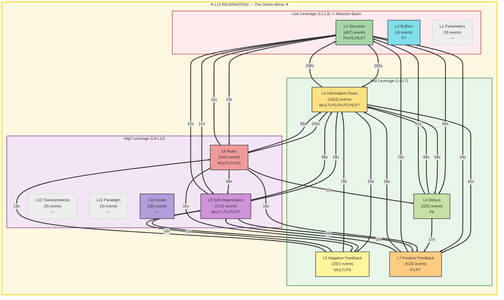

# Summoner Intelligence Report — Seals & Spheres

**Generated:** 2026-02-20T00:13:01 UTC
**Port:** P7 NAVIGATE | **Commander:** Spider Sovereign | **Spell:** TIME STOP
**AI Model:** gemini-2.5-flash (gemini) | **Inference:** 24969.0ms
**System Posture:** CRITICAL
**Trio:** Singer (P4) + Dancer (P5) + Summoner (P7)

> *Seals without Spheres is imprisonment. Spheres without Seals is chaos.*

---

## SEAL — Constraint Recommendation

| Field | Value |
|-------|-------|
| **Spell** | IMPRISONMENT |
| **Target** | The source of 'Tamper alerts' and associated integrity violations actively contributing to L13 FRACTURE. |
| **Meadows Level** | L8 |
| **Reason** | Active integrity violations (33/1h) are a critical threat, directly compromising the system's core coherence and contributing to the L13 FRACTURED state. Dancer explicitly calls for a 'PRISMATIC_WALL' against this persistent threat, which was not fully resolved by the previous seal. |

---

## SPHERE — Frontier Recommendation

| Field | Value |
|-------|-------|
| **Spell** | POLYMORPH_ANY_OBJECT |
| **Target** | The classification and routing mechanism for the 7607 'No port' documents. |
| **Meadows Level** | L9 |
| **Reason** | A vast majority of documents remain unrouted, representing significant untapped potential and systemic inefficiency. Reshaping this core process will unlock value, reduce 'gate block' violations (Singer's strife), and directly address the L13 fracture related to structural enforcement failures. |

---

## Landscape Assessment

The system is experiencing a critical L13 FRACTURED state with 244 violations, indicating a fundamental breakdown in identity and coherence. While information flows (L6) are dominant, active integrity violations, memory loss, and gate blocks persist, preventing the effective processing of a massive backlog of unrouted documents.

### Trio Coherence

Singer's strife (GATE_BLOCKED) and Dancer's death (Tamper alerts) and dawn (Memory loss) are directly addressed by the chosen Seal and Sphere, which target the root causes of L13 fracture and systemic inefficiency. There is strong alignment.

### Strange Loop Reflection

The previous IMPRISONMENT on 'Tamper alerts' did not fully eradicate the threat, indicating its persistent nature or a deeper root cause that requires a more forceful, sustained seal. The prior ETHEREAL_JAUNT for unrouted documents has not yet yielded a visible paradigm shift, prompting a more direct, transformative approach via POLYMORPH_ANY_OBJECT to reshape the processing of these documents.

---

## Meadows Leverage Landscape

### ⚠ L13 Holonarchy Violations (244)
- **MULTI System**: L13_IDENTITY: memory loss (cognitive persistence failure)
  Event 9618 at 2026-02-19T01:36:30
- **MULTI ?**: L5/L13: gate block (structural enforcement failure)
  Event 9622 at 2026-02-19T01:39:01
- **MULTI System**: L13_IDENTITY: memory loss (cognitive persistence failure)
  Event 9623 at 2026-02-19T01:39:01
- **MULTI ?**: L5/L13: gate block (structural enforcement failure)
  Event 9625 at 2026-02-19T01:39:01
- **MULTI ?**: L5/L13: gate block (structural enforcement failure)
  Event 9627 at 2026-02-19T01:39:01
- **MULTI ?**: L5/L13: gate block (structural enforcement failure)
  Event 9631 at 2026-02-19T01:39:27
- **MULTI ?**: L5/L13: gate block (structural enforcement failure)
  Event 9633 at 2026-02-19T01:39:27
- **MULTI ?**: L5/L13: gate block (structural enforcement failure)
  Event 9635 at 2026-02-19T01:39:27
- **MULTI System**: L13_IDENTITY: memory loss (cognitive persistence failure)
  Event 9641 at 2026-02-19T01:45:21
- **MULTI System**: L13_IDENTITY: memory loss (cognitive persistence failure)
  Event 9684 at 2026-02-19T03:21:59

---

## Cartography Data

| Metric | Value |
|--------|-------|
| Events classified | 3083 / 3083 |
| Hottest level | L6 (1052 events) |
| Attractor basin (L1-L3) | 13.3% |
| High leverage (L8-L12) | 16.0% |
| L13 status | FRACTURED — 244 violations (identity under pressure) |
| Active levels | [2, 3, 4, 5, 6, 7, 8, 9, 10] |
| Cold levels | [1, 11, 12, 13] |

---

## SSOT Health Snapshot

| Metric | Value |
|--------|-------|
| Total docs | 9862 |
| Total events | 12673 |
| Events/1h | 3083 |
| Docs without port | 7607 |
| Perceives/1h | 195 |
| Yields/1h | 178 |
| Gate blocked/1h | 177 |
| Memory loss/1h | 65 |

---

> *"The Tao gives birth to One. One gives birth to Two. Two gives birth to Three. Three gives birth to Ten Thousand Things. — Lao Tzu, Ch. 42"*

---

*SUMMONER OF SILK AND SOVEREIGNTY — Silk IS sovereignty — the web you wove IS your authority*

*Report generated by P7 Summoner of Seals and Spheres v1.0 | Gen89*