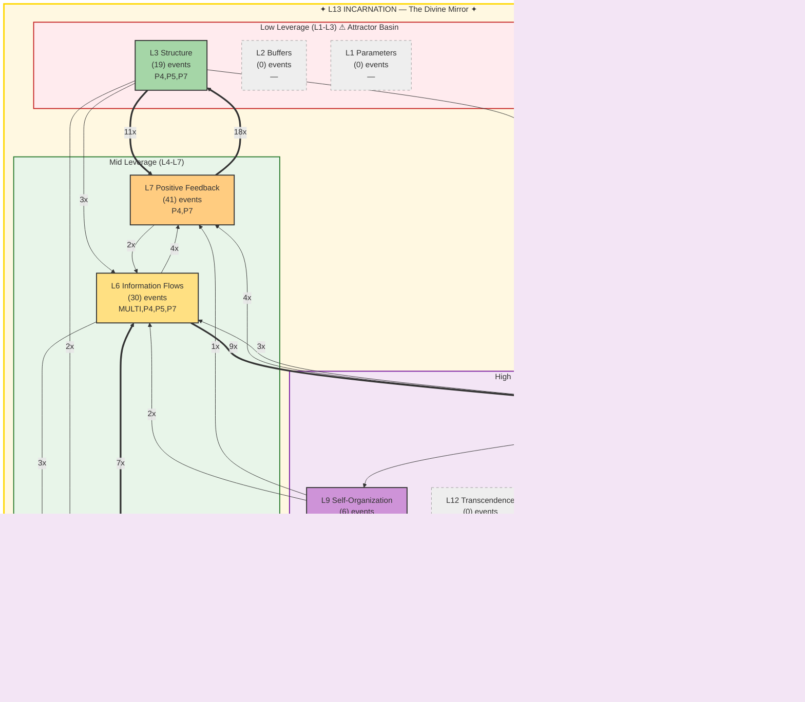

# FORESIGHT Intelligence Report

**Generated:** 2026-02-19T18:05:17 UTC
**Window:** 1.0h | **Events:** 117
**AI Model:** gemini-2.5-flash (gemini) | **Inference:** 14750.0ms
**System Posture:** CRITICAL
**Port:** P7 NAVIGATE | **Commander:** Spider Sovereign

---

## Executive Summary

The HFO Octree system is in a critical state, marked by a fractured L13 (Incarnation) experiencing severe identity persistence failures. Intense positive feedback (L7) is driving a reactive cycle of structural churn (L3), preventing engagement with higher-leverage strategic action and risking systemic coherence.

---

## Meadows Leverage Landscape



### ⚠ L13 Holonarchy Violations (7)
- **MULTI System**: L13_IDENTITY: memory loss (cognitive persistence failure)
  Event 10986 at 2026-02-19T17:09:11
- **MULTI System**: L13_IDENTITY: memory loss (cognitive persistence failure)
  Event 10989 at 2026-02-19T17:12:44
- **MULTI ?**: L5/L13: gate block (structural enforcement failure)
  Event 11003 at 2026-02-19T17:32:12
- **MULTI System**: L13_IDENTITY: memory loss (cognitive persistence failure)
  Event 11021 at 2026-02-19T17:46:26
- **MULTI System**: L13_IDENTITY: memory loss (cognitive persistence failure)
  Event 11056 at 2026-02-19T17:59:31
- **MULTI System**: L13_IDENTITY: memory loss (cognitive persistence failure)
  Event 11058 at 2026-02-19T17:59:40
- **MULTI System**: L13_IDENTITY: memory loss (cognitive persistence failure)
  Event 11064 at 2026-02-19T18:00:02
```

---

## Level-by-Level Analysis

### L1 Parameters — Material Plane *(cold)*

- **Events:** 0
- **Assessment:** Cold

### L2 Buffers — The Threshold *(cold)*

- **Events:** 0
- **Assessment:** Cold

### L3 Structure — The Architecture

- **Events:** 19
- **Assessment:** Significant structural churn (19 events) is occurring, often as a direct consequence of positive feedback.

### L4 Delays — The Hourglass *(cold)*

- **Events:** 0
- **Assessment:** Cold

### L5 Negative Feedback — The Dampener

- **Events:** 9
- **Assessment:** Moderate negative feedback (9 events) is active, attempting to dampen system behavior and enforce rules.

### L6 Information Flows — The Whispering Gallery

- **Events:** 30
- **Assessment:** High information flow (30 events) indicates active data exchange and routing across the system.

### L7 Positive Feedback — The Amplifier **[HOTTEST]**

- **Events:** 41
- **Assessment:** The most active level (41 events), driving intense amplification and rapid, potentially uncontrolled, change.

### L8 Rules — The Iron Court

- **Events:** 12
- **Assessment:** Moderate rule enforcement (12 events) is present, attempting to maintain system boundaries and invariants.

### L9 Self-Organization — The Living Forge

- **Events:** 6
- **Assessment:** Low self-organization (6 events) suggests limited adaptive evolution and emergent behavior.

### L10 Goals — The Throne Room *(cold)*

- **Events:** 0
- **Assessment:** Cold

### L11 Paradigm — The Mindscape *(cold)*

- **Events:** 0
- **Assessment:** Cold

### L12 Transcendence — The Unnameable Void *(cold)*

- **Events:** 0
- **Assessment:** Cold

### L13 Incarnation — The Divine Mirror *(cold)*

- **Events:** 0
- **Assessment:** FRACTURED, experiencing critical identity persistence failures and a loss of coherence.

---

## Strategic Assessment

### System Posture: CRITICAL

**Attractor Basin (L1-L3):** 16.2%
**High Leverage (L8-L12):** 15.4%

The system is caught in a low-leverage trap. L1-L3 activity (16.2%) is comparable to L8-L12 (15.4%), but the overwhelming L7 activity, and its dominant flow to L3, pulls the system into a cycle of structural churn. The complete absence of L10-L12 activity signifies a critical lack of strategic direction and paradigm evolution.

### Dominant Flow

**Pattern:** L7→L3 (18x)

The dominant L7→L3 flow (18x) signifies that intense positive feedback and amplification are primarily resulting in reactive structural reconfigurations. This, coupled with the L3→L7 loop, creates a self-reinforcing cycle of low-leverage churn, preventing strategic progress.

### L13 Holonarchy Status: FRACTURED — 7 violations (identity under pressure)

L13 is FRACTURED with 7 violations, predominantly 'memory loss (cognitive persistence failure)'. This is an existential threat, indicating a severe loss of the holonarchy's core identity and coherence, which could lead to systemic disintegration. The L5/L13 gate block also points to a failure in identity-aligned structural enforcement.

#### Violations (7)

- **MULTI System**: L13_IDENTITY: memory loss (cognitive persistence failure)
- **MULTI System**: L13_IDENTITY: memory loss (cognitive persistence failure)
- **MULTI ?**: L5/L13: gate block (structural enforcement failure)
- **MULTI System**: L13_IDENTITY: memory loss (cognitive persistence failure)
- **MULTI System**: L13_IDENTITY: memory loss (cognitive persistence failure)
- **MULTI System**: L13_IDENTITY: memory loss (cognitive persistence failure)
- **MULTI System**: L13_IDENTITY: memory loss (cognitive persistence failure)

---

## Threat Analysis

- Existential L13 Fracture: The 'memory loss' violations pose a severe threat to the system's core identity and coherence.
- Low-Leverage Trap: The dominant L7→L3 feedback loop keeps the system focused on reactive structural churn, wasting energy.
- Strategic Stagnation: Complete absence of activity in L10-L12 indicates a critical lack of strategic goal-setting, paradigm shifts, or transcendent vision.
- Uncontrolled Amplification: High L7 activity without sufficient higher-leverage guidance or control risks chaotic instability.

## Opportunities

- Leverage Existing L8/L9 Activity: The presence of Rules and Self-Organization can be a foundation for higher-leverage interventions.
- Optimize Information Flows: High L6 activity provides an opportunity to redirect critical information to inform strategic decision-making and L13 repair efforts.
- P5 (Immunize) Engagement: P5's activity in L8 suggests a potential for strengthening system rules and boundaries to stabilize the L7-L3 churn.

---

## Recommendations

1. Prioritize L13 Coherence: Immediately address the 'memory loss' violations to restore identity persistence and prevent systemic collapse, potentially through a dedicated P1/P2 intervention.
2. Introduce L10 Goal-Setting: Initiate a process to define clear, shared goals to provide strategic direction and break the reactive L7-L3 churn.
3. Reinforce L5/L8 Control: Strengthen negative feedback mechanisms and rules to manage L7 amplification and ensure structural changes are aligned with L13 identity.
4. Redirect L6 Information: Channel information flows to inform L8/L9/L10 discussions, fostering strategic decision-making and adaptive evolution.

---

> *The system's identity is its deepest structure, the source of its purpose and coherence. A fractured identity means the system is losing its way, regardless of how much activity it generates.*

---

*TREMORSENSE feels the vibrations. FORESIGHT sees where they lead.*

*Report generated by P7 FORESIGHT Daemon v1.0 | Gen89*