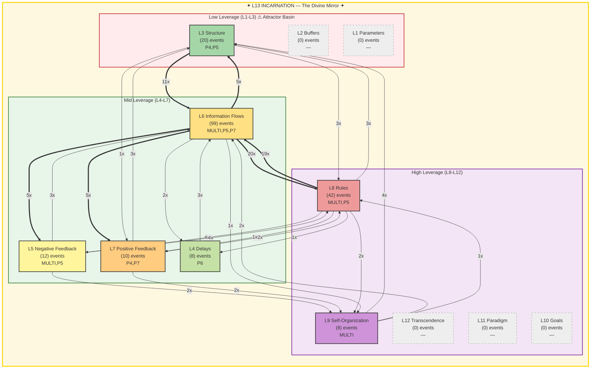

# Summoner Intelligence Report — Seals & Spheres

**Generated:** 2026-02-19T21:27:59 UTC
**Port:** P7 NAVIGATE | **Commander:** Spider Sovereign | **Spell:** TIME STOP
**AI Model:** gemini-2.5-flash (gemini) | **Inference:** 25875.0ms
**System Posture:** CRITICAL
**Trio:** Singer (P4) + Dancer (P5) + Summoner (P7)

> *Seals without Spheres is imprisonment. Spheres without Seals is chaos.*

---

## SEAL — Constraint Recommendation

| Field | Value |
|-------|-------|
| **Spell** | IMPRISONMENT |
| **Target** | The persistent 'dead component' and the underlying structural enforcement failure (L5/L13 violation) that allows it to continue causing gate blocking events, which are outnumbering perceived and yielded actions. |
| **Meadows Level** | L8 |
| **Reason** | Singer identifies 'POWERWORD_KILL' gate blocking, and Dancer explicitly states a 'dead component' continues to cause strife, having 'no redeeming qualities' and needing 'immediate action'. This antipattern is a critical operational failure, directly contributing to L5/L13 violations and system instability. |

---

## SPHERE — Frontier Recommendation

| Field | Value |
|-------|-------|
| **Spell** | POLYMORPH_ANY_OBJECT |
| **Target** | The 7675 'No port' documents, representing a massive unclassified and unrouted data mass, to be transformed into properly classified and integrated system resources. |
| **Meadows Level** | L9 |
| **Reason** | A significant portion of the system's documents (7675) remain unclassified and unrouted, indicating a fundamental failure in L3 Structure and L9 Self-Organization. Reshaping this undifferentiated mass into functional components will dramatically improve system efficiency, coherence, and address the L13_IDENTITY memory loss violation. |

---

## Landscape Assessment

The system is experiencing critical operational failures with gate blocking events exceeding perceived and yielded actions, driven by a persistent 'dead component'. Information flows (L6) heavily influence rules (L8), yet L13 remains fractured with violations related to gate blocks and memory loss, compounded by a vast quantity of unclassified documents.

### Trio Coherence

HIGH - Singer highlights the critical gate blocking strife, Dancer identifies the 'dead component' as the root cause needing immediate action, and Summoner's Seal directly targets this persistent antipattern. The Sphere addresses a massive structural inefficiency that contributes to the L13 identity issues.

### Strange Loop Reflection

My previous IMPRISONMENT on the 'dead component' was insufficient, as it continues to cause strife, indicating a deeper structural enforcement failure. The ETHEREAL_JAUNT for L13 fracture had some effect (violations reduced from 8 to 5), but the core identity issue persists, now notably exacerbated by the 'No port' document mass. This cycle, the Seal must target the *persistence mechanism*, and the Sphere must address a fundamental structural re-organization.

---

## Meadows Leverage Landscape

### ⚠ L13 Holonarchy Violations (5)
- **MULTI System**: L13_IDENTITY: memory loss (cognitive persistence failure)
  Event 11397 at 2026-02-19T20:27:55
- **MULTI ?**: L5/L13: gate block (structural enforcement failure)
  Event 11515 at 2026-02-19T20:50:09
- **MULTI System**: L13_IDENTITY: memory loss (cognitive persistence failure)
  Event 11516 at 2026-02-19T20:50:17
- **P5 Pyre Praetorian**: L5/L13: gate block (structural enforcement failure)
  Event 11558 at 2026-02-19T21:03:56
- **P5 Pyre Praetorian**: L5/L13: gate block (structural enforcement failure)
  Event 11567 at 2026-02-19T21:06:00

---

## Cartography Data

| Metric | Value |
|--------|-------|
| Events classified | 199 / 199 |
| Hottest level | L6 (99 events) |
| Attractor basin (L1-L3) | 10.1% |
| High leverage (L8-L12) | 25.1% |
| L13 status | FRACTURED — 5 violations (identity under pressure) |
| Active levels | [3, 4, 5, 6, 7, 8, 9] |
| Cold levels | [1, 2, 10, 11, 12, 13] |

---

## SSOT Health Snapshot

| Metric | Value |
|--------|-------|
| Total docs | 9861 |
| Total events | 11591 |
| Events/1h | 2001 |
| Docs without port | 7675 |
| Perceives/1h | 168 |
| Yields/1h | 160 |
| Gate blocked/1h | 175 |
| Memory loss/1h | 56 |

---

> *"The Tao gives birth to One. One gives birth to Two. Two gives birth to Three. Three gives birth to Ten Thousand Things. — Lao Tzu, Ch. 42"*

---

*SUMMONER OF SILK AND SOVEREIGNTY — Silk IS sovereignty — the web you wove IS your authority*

*Report generated by P7 Summoner of Seals and Spheres v1.0 | Gen89*