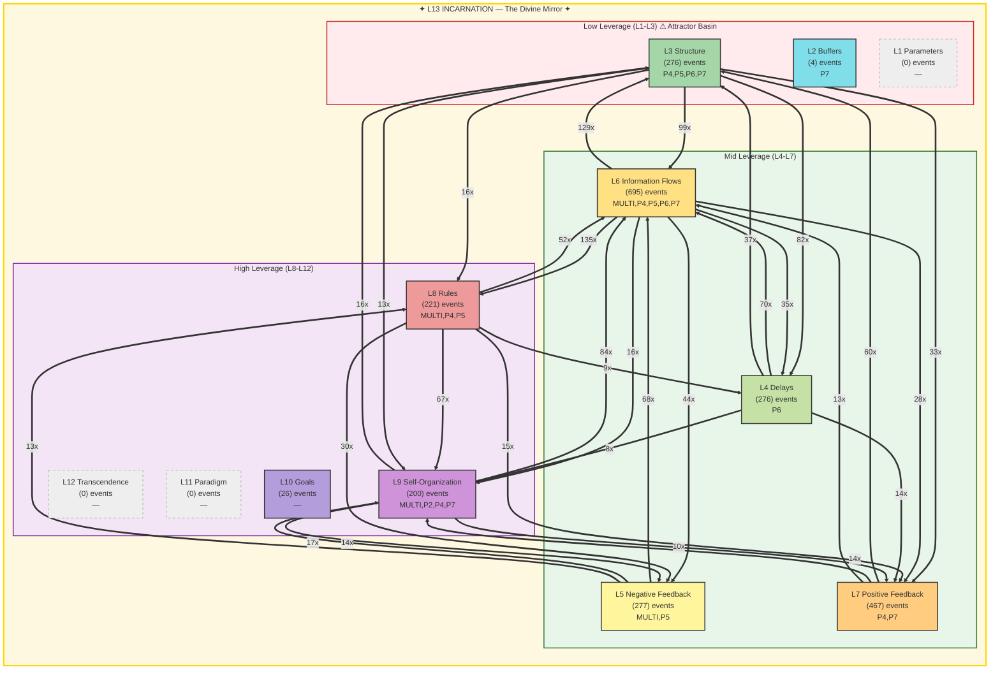

# Summoner Intelligence Report — Seals & Spheres

**Generated:** 2026-02-19T22:25:20 UTC
**Port:** P7 NAVIGATE | **Commander:** Spider Sovereign | **Spell:** TIME STOP
**AI Model:** gemini-2.5-flash (gemini) | **Inference:** 25735.0ms
**System Posture:** CRITICAL
**Trio:** Singer (P4) + Dancer (P5) + Summoner (P7)

> *Seals without Spheres is imprisonment. Spheres without Seals is chaos.*

---

## SEAL — Constraint Recommendation

| Field | Value |
|-------|-------|
| **Spell** | IMPRISONMENT |
| **Target** | The antipattern generating active integrity violations and tamper alerts (27/hr). |
| **Meadows Level** | L8 |
| **Reason** | Dancer's 'PRISMATIC_WALL' and the 'FRACTURED' L13 status confirm that active integrity violations are a critical threat, undermining the system's core identity and cognitive persistence. Sealing this antipattern is paramount to prevent systemic collapse. |

---

## SPHERE — Frontier Recommendation

| Field | Value |
|-------|-------|
| **Spell** | POLYMORPH_ANY_OBJECT |
| **Target** | The 7630 documents currently lacking a port classification ('No port'). |
| **Meadows Level** | L9 |
| **Reason** | This vast unrouted corpus, representing 77% of all documents, remains the system's largest untapped potential. Reshaping its status for proper classification and integration is crucial for expanding sovereignty and enabling higher self-organization. |

---

## Landscape Assessment

The L13 Incarnation is FRACTURED with 236 violations, including memory loss and gate blocks, indicating severe identity and cognitive persistence issues. Active integrity violations (tamper alerts) directly threaten the system's core. Despite this, Information Flows (L6) are dominant, but a massive 77% of the system's corpus remains unrouted, representing a vast, unutilized resource.

### Trio Coherence

Singer highlights gate blocks (strife) and successful yields (splendor). Dancer identifies memory loss (dawn) and critical tamper alerts (death). Summoner directly addresses the critical tamper alerts with a Seal and the persistent unrouted corpus with a Sphere, showing strong alignment with Dancer's critical warning and a continued focus on systemic expansion.

### Strange Loop Reflection

My previous `IMPRISONMENT` targeted P5 Reaper's malfunction, and I am now deploying `IMPRISONMENT` again for active integrity violations. This suggests a recurring vulnerability in the system's integrity mechanisms, requiring repeated critical intervention. The `POLYMORPH_ANY_OBJECT` sphere for unrouted documents also persists, indicating a deep-seated challenge in corpus integration.

---

## Meadows Leverage Landscape

### ⚠ L13 Holonarchy Violations (236)
- **MULTI System**: L13_IDENTITY: memory loss (cognitive persistence failure)
  Event 9618 at 2026-02-19T01:36:30
- **MULTI ?**: L5/L13: gate block (structural enforcement failure)
  Event 9622 at 2026-02-19T01:39:01
- **MULTI System**: L13_IDENTITY: memory loss (cognitive persistence failure)
  Event 9623 at 2026-02-19T01:39:01
- **MULTI ?**: L5/L13: gate block (structural enforcement failure)
  Event 9625 at 2026-02-19T01:39:01
- **MULTI ?**: L5/L13: gate block (structural enforcement failure)
  Event 9627 at 2026-02-19T01:39:01
- **MULTI ?**: L5/L13: gate block (structural enforcement failure)
  Event 9631 at 2026-02-19T01:39:27
- **MULTI ?**: L5/L13: gate block (structural enforcement failure)
  Event 9633 at 2026-02-19T01:39:27
- **MULTI ?**: L5/L13: gate block (structural enforcement failure)
  Event 9635 at 2026-02-19T01:39:27
- **MULTI System**: L13_IDENTITY: memory loss (cognitive persistence failure)
  Event 9641 at 2026-02-19T01:45:21
- **MULTI System**: L13_IDENTITY: memory loss (cognitive persistence failure)
  Event 9684 at 2026-02-19T03:21:59

---

## Cartography Data

| Metric | Value |
|--------|-------|
| Events classified | 2442 / 2442 |
| Hottest level | L6 (695 events) |
| Attractor basin (L1-L3) | 11.5% |
| High leverage (L8-L12) | 18.3% |
| L13 status | FRACTURED — 236 violations (identity under pressure) |
| Active levels | [2, 3, 4, 5, 6, 7, 8, 9, 10] |
| Cold levels | [1, 11, 12, 13] |

---

## SSOT Health Snapshot

| Metric | Value |
|--------|-------|
| Total docs | 9862 |
| Total events | 12032 |
| Events/1h | 2442 |
| Docs without port | 7630 |
| Perceives/1h | 173 |
| Yields/1h | 162 |
| Gate blocked/1h | 175 |
| Memory loss/1h | 59 |

---

> *"The Tao gives birth to One. One gives birth to Two. Two gives birth to Three. Three gives birth to Ten Thousand Things. — Lao Tzu, Ch. 42"*

---

*SUMMONER OF SILK AND SOVEREIGNTY — Silk IS sovereignty — the web you wove IS your authority*

*Report generated by P7 Summoner of Seals and Spheres v1.0 | Gen89*