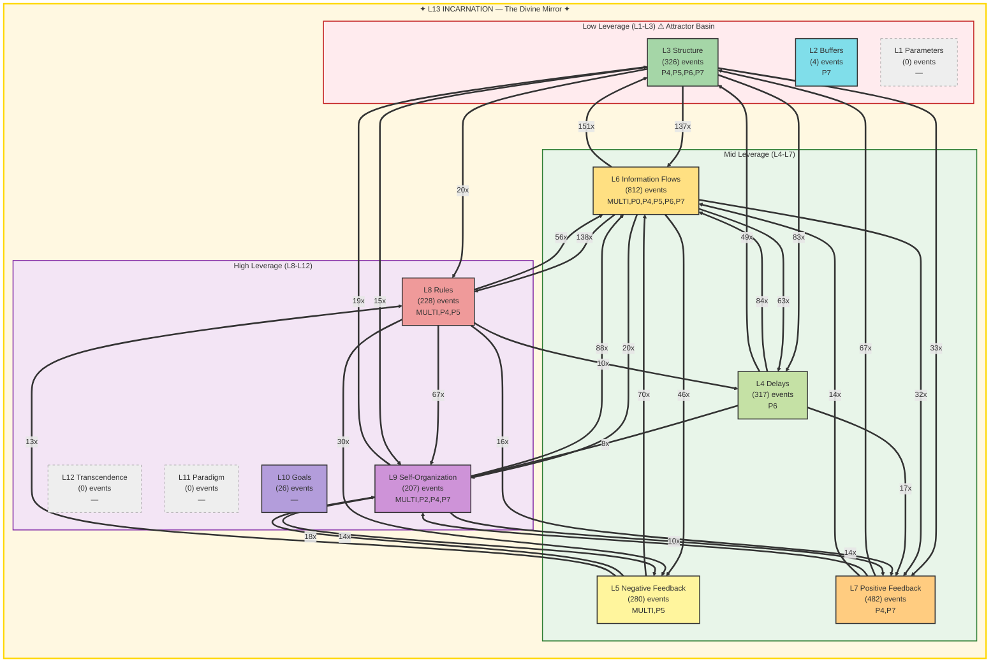

# Summoner Intelligence Report — Seals & Spheres

**Generated:** 2026-02-19T22:55:52 UTC
**Port:** P7 NAVIGATE | **Commander:** Spider Sovereign | **Spell:** TIME STOP
**AI Model:** gemini-2.5-flash (gemini) | **Inference:** 23719.0ms
**System Posture:** CRITICAL
**Trio:** Singer (P4) + Dancer (P5) + Summoner (P7)

> *Seals without Spheres is imprisonment. Spheres without Seals is chaos.*

---

## SEAL — Constraint Recommendation

| Field | Value |
|-------|-------|
| **Spell** | IMPRISONMENT |
| **Target** | The persistent L13 FRACTURED status, specifically its manifestations as memory loss, gate blocks, and tamper alerts, which indicate a fundamental integrity and identity failure. |
| **Meadows Level** | L13 |
| **Reason** | The system's L13 Incarnation remains FRACTURED with 237 violations, including active tamper alerts (28/1h), memory loss (60/1h), and gate blocks (175/1h). This represents a critical, ongoing antipattern of integrity and identity failure that must be sealed. |

---

## SPHERE — Frontier Recommendation

| Field | Value |
|-------|-------|
| **Spell** | FORESIGHT |
| **Target** | The strategic potential and underlying purpose of the 7607 unrouted documents (77% of the total corpus). |
| **Meadows Level** | L10 |
| **Reason** | A vast 77% of the system's documents remain unrouted, representing a massive untapped resource or a critical blind spot. Gaining foresight into their strategic potential is crucial for redefining system goals and potentially healing the L13 fracture. |

---

## Landscape Assessment

The system's L13 Incarnation is FRACTURED with 237 violations, including persistent memory loss, gate blocks, and tamper alerts, indicating a severe identity and structural integrity crisis. While information flows (L6) are dominant, a critical mass of 77% of documents remains unrouted, pointing to a fundamental breakdown in processing and classification despite active high leverage levels.

### Trio Coherence

Singer's strife (Gate Blocked) and Dancer's concerns (Memory Loss, Tamper Alerts) directly align with the L13 FRACTURED status targeted by the Seal. The Sphere addresses the massive unrouted corpus, a key symptom of the system's inability to integrate information, showing strong coherence.

### Strange Loop Reflection

My previous IMPRISONMENT for the L13 fracture and PRISMATIC_WALL did not fully resolve the issue, as violations persist, indicating a deeper or more resilient antipattern. The prior POLYMORPH_ANY_OBJECT for the unrouted corpus also requires further strategic insight (FORESIGHT) to succeed.

---

## Meadows Leverage Landscape

### ⚠ L13 Holonarchy Violations (237)
- **MULTI System**: L13_IDENTITY: memory loss (cognitive persistence failure)
  Event 9618 at 2026-02-19T01:36:30
- **MULTI ?**: L5/L13: gate block (structural enforcement failure)
  Event 9622 at 2026-02-19T01:39:01
- **MULTI System**: L13_IDENTITY: memory loss (cognitive persistence failure)
  Event 9623 at 2026-02-19T01:39:01
- **MULTI ?**: L5/L13: gate block (structural enforcement failure)
  Event 9625 at 2026-02-19T01:39:01
- **MULTI ?**: L5/L13: gate block (structural enforcement failure)
  Event 9627 at 2026-02-19T01:39:01
- **MULTI ?**: L5/L13: gate block (structural enforcement failure)
  Event 9631 at 2026-02-19T01:39:27
- **MULTI ?**: L5/L13: gate block (structural enforcement failure)
  Event 9633 at 2026-02-19T01:39:27
- **MULTI ?**: L5/L13: gate block (structural enforcement failure)
  Event 9635 at 2026-02-19T01:39:27
- **MULTI System**: L13_IDENTITY: memory loss (cognitive persistence failure)
  Event 9641 at 2026-02-19T01:45:21
- **MULTI System**: L13_IDENTITY: memory loss (cognitive persistence failure)
  Event 9684 at 2026-02-19T03:21:59

---

## Cartography Data

| Metric | Value |
|--------|-------|
| Events classified | 2682 / 2682 |
| Hottest level | L6 (812 events) |
| Attractor basin (L1-L3) | 12.3% |
| High leverage (L8-L12) | 17.2% |
| L13 status | FRACTURED — 237 violations (identity under pressure) |
| Active levels | [2, 3, 4, 5, 6, 7, 8, 9, 10] |
| Cold levels | [1, 11, 12, 13] |

---

## SSOT Health Snapshot

| Metric | Value |
|--------|-------|
| Total docs | 9862 |
| Total events | 12272 |
| Events/1h | 2682 |
| Docs without port | 7607 |
| Perceives/1h | 179 |
| Yields/1h | 167 |
| Gate blocked/1h | 175 |
| Memory loss/1h | 60 |

---

> *"The Tao gives birth to One. One gives birth to Two. Two gives birth to Three. Three gives birth to Ten Thousand Things. — Lao Tzu, Ch. 42"*

---

*SUMMONER OF SILK AND SOVEREIGNTY — Silk IS sovereignty — the web you wove IS your authority*

*Report generated by P7 Summoner of Seals and Spheres v1.0 | Gen89*